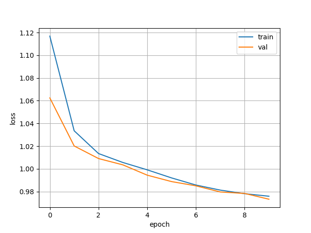

# GAE-DGL
Graph Auto-encoder [1] implemented with DGL by Shion Honda.  
Official implementation by the authors is [here](https://github.com/tkipf/gae) (TensorFlow, Python 2.7).

## Installation
### Prerequisites
You need PyTorch and DGL at least and the rest to try inductive settings with molecular graphs.

```
PyTorch
DeepGraphLibrary
RDKit
dill
tqdm
```

## Usage
### Transductive tasks ( :construction: under development :construction: )
Reproduce the results of the paper [1] by the following command.

```
$ python train_transductive.py --dataset cora
```

You can switch the dataset to use by assigning to the `--dataset` option one from `cora/citeseer/pubmed`.

### Inductive tasks
This repository supports learning graph representations of molecules in the ZINC-250k dataset (or any unlabeled SMILES dataset). Run pre-training by the following commands.  

```
$ python prepare_data.py # download and preprocess zinc dataset
$ python train_inductive.py --hidden_dims 32 16 # pre-train GAE
```

The ZINC-250k is a subset of ZINC dataset and can be obtained easily by, for example, [Chainer Chemistry](https://github.com/pfnet-research/chainer-chemistry).  
Interestingly, I found GAE also works in inductive settings even though it was not tested in the original paper [1].



## Potential Application to Chemistry
Is learned feature useful for predicting molecular properties? Let's check with simple examples. Here I use ESOL (solubility regression) dataset from [2], which can be downloaded [here](http://moleculenet.ai/datasets-1).

|Feature + Model|RMSE|R2|  
|:--:|:--:|:--:|
|GAE + Ridge|1.813|0.585|  
|**GAE + MLP**|**1.216**|**0.732**|    
|GAE + Random Forest|1.424|0.688|    
|ECFP + Ridge|2.271|0.480|  
|ECFP + MLP|2.034|0.549|    
|ECFP + Random Forest|1.668|0.643|    

ECFP is a hash-based binary feature of molecules ($D=1024$), which is the most common algorithm as a baseline.  
GAE feature is a concatenation of mean, sum, and max aggregation of the hidden vector $\textbf{H} \in \mathbb{R}^{N\times 16}$, so its dimension is 48.  
GAE performs better than ECFP in all the combination with three regression models: Ridge, Multi-layer perceptron, and Random Forest.

## References
[1] Thomas N. Kipf and Max Welling. "[Variational Graph Auto-Encoders](https://arxiv.org/abs/1611.07308)." NIPS. 2016.

[2] Zhenqin Wu, Bharath Ramsundar, Evan N. Feinberg, Joseph Gomes, Caleb Geniesse, Aneesh S. Pappu, Karl Leswing, Vijay Pande. "[MoleculeNet: A Benchmark for Molecular Machine Learning](https://pubs.rsc.org/en/content/articlelanding/2018/sc/c7sc02664a)", Chemical Science. 2018.