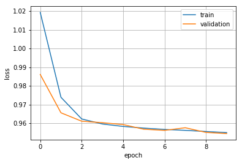

# GAE-DGL
Graph Autoencoder[1] implemented with DGL by Shion Honda.  
Official implementation by the authors is [here](https://github.com/tkipf/gae) (TensorFlow, Python 2.7).

## Installation
### Prerequisites
You need PyTorch and DGL at least and the rest to try inductive settings.

```
PyTorch
Deep Graph Library
RDKit
dill
tqdm
```

## Usage
### Transductive tasks
You can reproduce the results of the paper by the following command.

```
$ python train_transductive.py --dataset cora
```

You can switch the dataset to use by assigning to the `--dataset` option one from `cora/citeseer/pubmed`.

### Inductive tasks
This repository supports learning graph representations of molecules in the ChEMBL24 dataset (or any unlabeled SMILES dataset). Run pre-training by the following commands.  

```
$ python prepare_data.py
$ python train_inductive.py
```

The ChEMBL dataset can be obtained [here](https://chembl.gitbook.io/chembl-interface-documentation/downloads).  
Interestingly, though it was not tested in the original paper [1], I found GAE also works in inductive settings.



## References
[1] Thomas N. Kipf and Max Welling, "[Variational Graph Auto-Encoders](https://arxiv.org/abs/1611.07308)", NIPS, 2016.